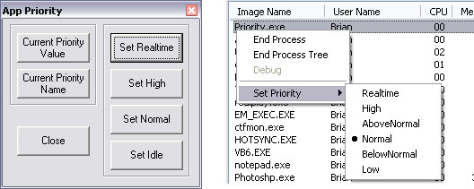



## Windows Priority \(Make Windows give your program more time\.\)

### Description

Have you ever wanted to make windows give your program a larger slice of time???

Windows is setup to give each program its own slice of CPU time, some programs

are of higher importance, ie.. system, file i/o, etc...Some like Screen Savers are lower.

The higher the priority the more likely that it will receive the CPU time it needs.

This Module will allow you to change the Priority Level of your Programs when you need to make sure that you are getting enough CPU time during heavy loads.

The module can be reused in any program, and the Form simply shows what the module is capable of. The source code is Fully commented, and an explaination of the Priority levels is included in the module.

The picture shows the Windows Task Manager from Win XP, and if you right click on a process it will allow you to change the Priority. This module does the same thing only progmatically. Win 9x does not have the processes tab, but you can still use this module on those systems.

This is compatible with Win95 & Up and WinNT 3.1 & up.
 
### More Info
 

             |
---                |---
**Submitted On**   |2002-01-22 20:50:50
**By**             |[Brian Schmitt](https://github.com/Planet-Source-Code/PSCIndex/blob/master/ByAuthor/brian-schmitt.md)
**Level**          |Intermediate
**User Rating**    |4.5 (36 globes from 8 users)
**Compatibility**  |VB 4\.0 \(32\-bit\), VB 5\.0, VB 6\.0
**Category**       |[Windows API Call/ Explanation](https://github.com/Planet-Source-Code/PSCIndex/blob/master/ByCategory/windows-api-call-explanation__1-39.md)
**World**          |[Visual Basic](https://github.com/Planet-Source-Code/PSCIndex/blob/master/ByWorld/visual-basic.md)
**Archive File**   |[Windows\_Pr504721222002\.zip](https://github.com/Planet-Source-Code/brian-schmitt-windows-priority-make-windows-give-your-program-more-time__1-31088/archive/master.zip)

